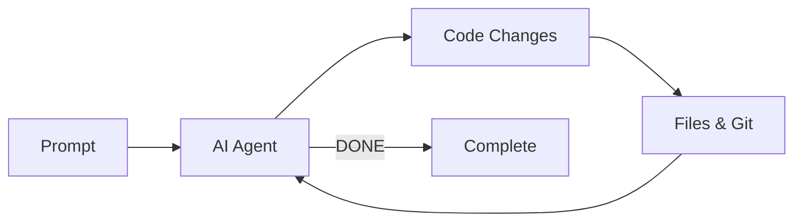

# Ralph Wiggum for Kiro CLI

Implementation of the [Ralph Wiggum technique](https://ghuntley.com/ralph/) for iterative, self-referential AI development loops in Kiro CLI.

> **IMPORTANT: Human Oversight Required**
>
> This tool runs Kiro CLI in a fully autonomous loop using `--no-interactive` and `--trust-all-tools` flags via subprocess. This means:
>
> - **The AI agent can execute ANY tool without confirmation** (file writes, shell commands, etc.)
> - **No human approval is required** between iterations
> - **The loop runs until completion or max iterations** - potentially for hours
>
> **You MUST monitor and review all output.** Do not leave Ralph running unattended on production systems or sensitive codebases. Always use `--max-iterations` to set a reasonable limit.
>
> **Requires:** Latest version of [Kiro CLI](https://kiro.dev/) installed and authenticated.

## What is Ralph Wiggum?

Ralph Wiggum is a development methodology based on continuous AI agent loops. As Geoffrey Huntley describes it: **"Ralph is a Bash loop"** - a simple `while true` that repeatedly feeds an AI agent a prompt, allowing it to iteratively improve its work until completion.

The technique is named after Ralph Wiggum from The Simpsons, embodying the philosophy of persistent iteration despite setbacks.

### Core Concept

```bash
while true; do
  cat PROMPT.md | kiro-cli chat --agent ralph-wiggum --no-interactive
  # Check for completion
done
```

This creates a **self-referential feedback loop** where:
- The prompt never changes between iterations
- The agent's previous work persists in files
- Each iteration sees modified files and git history
- The agent autonomously improves by reading its own past work



## Tech Stack

| Component | Technology | Purpose |
|-----------|------------|---------|
| Runtime | [Bun 1.3](https://bun.sh/) | Fast JavaScript/TypeScript runtime |
| Language | TypeScript | Type-safe development |
| CLI Framework | [Commander](https://github.com/tj/commander.js) | Command-line interface parsing |
| Data Validation | [Zod](https://zod.dev/) | Schema validation |
| Configuration | [yaml](https://github.com/eemeli/yaml) | YAML frontmatter parsing |
| Terminal UI | [@clack/prompts](https://github.com/natemoo-re/clack) + [picocolors](https://github.com/alexeyraspopov/picocolors) | Interactive prompts and colored output |
| Database | [bun:sqlite](https://bun.sh/docs/api/sqlite) | Session reading from Kiro CLI |
| Task Runner | [mise](https://mise.jdx.dev/) | Development task automation |
| AI Backend | [Kiro CLI](https://kiro.dev/) | AI agent execution |
| Testing | [bun:test](https://bun.sh/docs/cli/test) | Built-in test framework |
| Linting | [Biome](https://biomejs.dev/) | Fast linting and formatting |

## Architecture

### Project Structure

```
ralph-wiggum/
├── src/
│   ├── index.ts              # CLI entry point
│   ├── version.ts            # Version export
│   ├── commands/             # CLI command implementations
│   │   ├── init.ts           # Initialize Ralph in a project
│   │   ├── loop.ts           # Start an iterative loop
│   │   └── cancel.ts         # Cancel an active loop
│   ├── core/                 # Core business logic
│   │   ├── loop-runner.ts    # Main loop orchestration
│   │   ├── kiro-client.ts    # Kiro CLI subprocess wrapper
│   │   └── session-reader.ts # SQLite session reader
│   ├── schemas/              # Zod schemas
│   │   ├── config.ts         # Loop configuration
│   │   ├── state.ts          # Loop state (markdown serialization)
│   │   └── session.ts        # Kiro session parsing
│   ├── utils/                # Utility functions
│   │   └── paths.ts          # Path helpers
│   └── data/                 # Bundled template files
│       ├── ralph-wiggum.json # Kiro agent config template
│       └── ralph-context.md  # Agent steering instructions
└── tests/                    # Test suite
    ├── cli.test.ts
    ├── commands.test.ts
    ├── core.test.ts
    └── schemas.test.ts
```

### Component Diagram


### Data Flow


### State Machine


## Installation

```bash
# Clone and install
git clone <this-repo>
cd ralph-wiggum
bun install

# Run in development
bun run dev

# Build standalone executable
bun run build
```

## Quick Start

```bash
# Initialize Ralph in your project (creates .kiro/agents/ and .kiro/steering/)
ralph init

# Start a Ralph loop
ralph loop "Build a REST API for todos with CRUD operations and tests" \
  --completion-promise "COMPLETE" \
  --max-iterations 20
```

The agent will:
1. Work on the task iteratively
2. See its previous work in files/git each iteration
3. Continue until it outputs `<promise>COMPLETE</promise>`
4. Or stop when max iterations is reached

## Commands

### `ralph init`

Initialize Ralph Wiggum in the current project.

```bash
ralph init [--force]
```

Creates:
- `.kiro/agents/ralph-wiggum.json` - Kiro agent configuration
- `.kiro/steering/ralph-context.md` - Agent steering/context file

**Options:**
- `--force` - Overwrite existing files if they exist

### `ralph loop`

Start a Ralph loop.

```bash
ralph loop <PROMPT> [OPTIONS]
```

**Arguments:**
- `PROMPT` - Task description for the agent

**Options:**
- `--min-iterations, -n` - Minimum iterations before accepting completion (default: 1)
- `--max-iterations, -m` - Max iterations before auto-stop (default: 0=unlimited)
- `--completion-promise, -p` - Phrase that signals completion
- `--agent, -a` - Path to custom agent config

**Examples:**

```bash
# Basic loop with iteration limit
ralph loop "Fix the authentication bug" -m 10

# Loop with completion promise and minimum iterations
ralph loop "Add input validation" -p "VALIDATION COMPLETE" -n 3 -m 20

# Custom agent config
ralph loop "Build feature X" -a ./my-agent.json -m 15
```

### `ralph cancel`

Cancel an active Ralph loop.

```bash
ralph cancel
```

## How It Works

### 1. State File

Loop state is stored in `.kiro/ralph-loop.local.md` with YAML frontmatter:

```yaml
---
active: true
iteration: 3
min_iterations: 2
max_iterations: 20
completion_promise: COMPLETE
started_at: '2026-01-07T12:00:00Z'
previous_feedback:
  quality_score: 7
  quality_summary: Good progress on API endpoints
  improvements:
    - Add input validation
    - Increase test coverage
  next_steps:
    - Implement validation middleware
    - Write integration tests
  ideas:
    - Consider adding rate limiting
  blockers: []
---

Build a REST API with CRUD operations...
```

The agent reads this file to understand:
- Current iteration number
- When it's allowed to complete (after `min_iterations`)
- The completion phrase to output
- Feedback from the previous iteration (for continuity)

### 2. Session Reading

After each Kiro CLI iteration:
- Ralph reads the session from Kiro's SQLite database (`~/.local/share/kiro-cli/data.sqlite3`)
- Parses the conversation history using Zod schemas
- Extracts the last assistant message

### 3. Completion Detection

The loop checks for `<promise>PHRASE</promise>` in the last assistant message:

- Case insensitive matching
- Flexible whitespace handling
- Only triggers after `min_iterations` reached
- Uses safe regex pattern to prevent ReDoS attacks

### 4. Structured Feedback

At the end of each iteration, the agent outputs structured feedback in XML format:

```xml
<ralph-feedback>
  <quality-assessment>
    <score>7</score>
    <summary>Good progress on core functionality</summary>
  </quality-assessment>
  <improvements>
    - Add more edge case tests
    - Refactor duplicate code
  </improvements>
  <next-steps>
    - Implement caching
    - Add documentation
  </next-steps>
  <ideas>
    - Could add CLI flag for verbose output
    - Consider progress indicators
  </ideas>
  <blockers>
    - Need clarification on auth requirements
  </blockers>
</ralph-feedback>
```

This feedback is parsed and included in the state file for the next iteration, creating a memory bridge between sessions.

### 5. Minimum Iterations

The `--min-iterations` flag prevents premature completion:
- Agent must use early iterations productively
- Promise tags are ignored until minimum is reached
- Forces thorough work before declaring done

## Runtime Files

After running `ralph init`, your project will have:

```
your-project/
└── .kiro/
    ├── agents/
    │   └── ralph-wiggum.json   # Kiro agent config
    ├── steering/
    │   └── ralph-context.md    # Agent steering context
    └── ralph-loop.local.md     # Loop state (created during loop)
```

## Development

### Prerequisites

- [Bun](https://bun.sh/) 1.3+
- [mise](https://mise.jdx.dev/) (optional, for task running)
- [Kiro CLI](https://kiro.dev/) installed and authenticated

### Recommended Kiro CLI Settings

For optimal Ralph Wiggum usage, configure your Kiro CLI settings in `~/.kiro/settings/cli.json`:

```json
{
  "chat.defaultModel": "claude-opus-4.5",
  "chat.greeting.enabled": false,
  "mcp.loadedBefore": true,
  "mcp.noInteractiveTimeout": 30000,
  "mcp.initTimeout": 30000,
  "chat.enableTodoList": true,
  "chat.enableDelegate": true,
  "chat.enableCheckpoint": true,
  "chat.enableThinking": true,
  "chat.enableContextUsageIndicator": true,
  "chat.enableKnowledge": true,
  "chat.enableTangentMode": true,
  "introspec.tangentMode": true
}
```

### Setup

```bash
bun install
```

### Running Tests

```bash
# Using bun directly
bun test                    # Run all tests
bun test --coverage         # Run with coverage
bun test --watch            # Watch mode

# Using mise
mise run test               # Run all tests
mise run test:coverage      # Run with coverage
mise run test:watch         # Watch mode
```

### Available Scripts

| Script | Description |
|--------|-------------|
| `bun run dev` | Run CLI in development mode |
| `bun run build` | Build standalone executable |
| `bun test` | Run tests |
| `bun run lint` | Run Biome linter |
| `bun run lint:fix` | Lint with auto-fix |
| `bun run format` | Format code |
| `bun run typecheck` | Run TypeScript type checking |
| `bun pm scan` | Scan dependencies for vulnerabilities |

### Available mise Tasks

| Task | Description |
|------|-------------|
| `mise run dev` | Run CLI in development mode |
| `mise run build` | Build standalone executable |
| `mise run test` | Run tests |
| `mise run test:coverage` | Run tests with coverage |
| `mise run test:watch` | Run tests in watch mode |
| `mise run lint` | Run Biome linter |
| `mise run lint:fix` | Lint with auto-fix |
| `mise run format` | Format code |
| `mise run format:check` | Check code formatting |
| `mise run typecheck` | Run TypeScript type checking |
| `mise run audit` | Scan dependencies for vulnerabilities |
| `mise run security:auto` | Run Semgrep with auto-detection rules |
| `mise run security:owasp` | Run Semgrep with OWASP Top 10 rules |
| `mise run security:all` | Run all security scans |

## Prompt Writing Best Practices

### Clear Completion Criteria

Bad:
```
Build a todo API and make it good.
```

Good:
```
Build a REST API for todos.

When complete:
- All CRUD endpoints working
- Input validation in place
- Tests passing (coverage > 80%)
- Output: <promise>COMPLETE</promise>
```

### Incremental Goals

Bad:
```
Create a complete e-commerce platform.
```

Good:
```
Phase 1: User authentication (JWT, tests)
Phase 2: Product catalog (list/search, tests)
Phase 3: Shopping cart (add/remove, tests)

Output <promise>COMPLETE</promise> when all phases done.
```

### Safety Nets

Always use `--max-iterations` to prevent infinite loops:

```bash
# Recommended: Always set a reasonable limit
ralph loop "Your task" --max-iterations 20 --completion-promise "DONE"
```

## Philosophy

Ralph embodies several key principles:

1. **Iteration > Perfection** - Don't aim for perfect on first try
2. **Failures Are Data** - Use them to tune prompts
3. **Operator Skill Matters** - Success depends on good prompts
4. **Persistence Wins** - Keep trying until success

## When to Use Ralph

**Good for:**
- Well-defined tasks with clear success criteria
- Tasks requiring iteration and refinement
- Greenfield projects where you can walk away
- Tasks with automatic verification (tests, linters)

**Not good for:**
- Tasks requiring human judgment
- One-shot operations
- Tasks with unclear success criteria
- Production debugging

## Learn More

- [Original technique by Geoffrey Huntley](https://ghuntley.com/ralph/)
- [Ralph Orchestrator](https://github.com/mikeyobrien/ralph-orchestrator)
- [Kiro CLI Documentation](https://kiro.dev/docs/cli/)

## License

MIT
